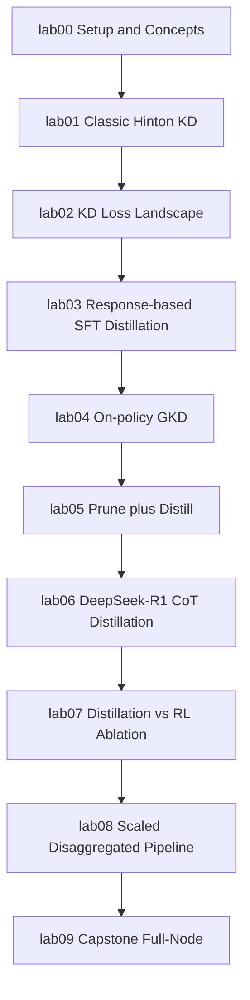

# LLM & Model Distillation Labs

A self-contained, hands-on curriculum for learning **model and LLM
distillation** - from the classic Hinton et al. (2015) recipe through the
techniques used in modern frontier work (on-policy distillation, structured
pruning + recovery, and a DeepSeek-R1-style reasoning-distillation case
study), finishing with a full 8-GPU capstone project.

Every lab is plain Python scripts + a `README.md` (no notebooks) so they're
easy to run over SSH, adapt, and re-run at different scales. Each lab README
explains the theory (with the relevant math and paper citations) before you
run anything.

## Curriculum

| Lab | Topic | GPUs | Time |
|---|---|---|---|
| [lab00](labs/lab00_setup_and_concepts) | Environment check + taxonomy of distillation | 1 | <5 min |
| [lab01](labs/lab01_classic_kd_hinton) | Classic knowledge distillation (Hinton et al. 2015) | 1 | ~20 min |
| [lab02](labs/lab02_kd_loss_landscape) | KD loss landscape: forward/reverse KL, JSD | 1 | ~25 min |
| [lab03](labs/lab03_response_based_sft_distillation) | Response-based / SFT distillation | 1-2 | ~45 min |
| [lab04](labs/lab04_onpolicy_gkd) | On-policy distillation (GKD) | 2 | ~45 min |
| [lab05](labs/lab05_prune_and_distill) | Structured pruning + distillation recovery | 2-4 | ~60 min |
| [lab06](labs/lab06_reasoning_cot_distillation) | Reasoning/CoT distillation: a DeepSeek-R1 case study | 2-4 | ~75 min |
| [lab07](labs/lab07_distillation_vs_rl_ablation) | Distillation vs. RL ablation (reproducing R1 Table 6) | 1-2 | ~60 min |
| [lab08](labs/lab08_scaled_pipeline_multi_gpu) | Scaled, disaggregated teacher/student pipeline | 6-8 | ~90 min |
| [lab09](labs/lab09_capstone_full_node) | Capstone: full 8-GPU node distillation project | 8 | ~2-4 hrs |



Labs 00-04 teach the fundamentals on small models/datasets so each run takes
minutes. Lab05 introduces multi-GPU training. Labs 06-07 are a two-part case
study reproducing DeepSeek-R1's own justification for reasoning distillation.
Labs 08-09 scale everything up to use most/all of the node.

## Hardware this was built for

- 8x NVIDIA B200 (183GB each, ~1.4TB total GPU memory), NVLink/NVSwitch node
- CUDA 13.0, `torch 2.11+cu130`, `transformers >= 4.47`, `trl >= 0.27`,
  `peft >= 0.14`, `accelerate >= 1.2`, `deepspeed >= 0.16`, `vllm >= 0.7`,
  `datasets >= 3.2`, `flash-attn` (optional but recommended)
- HF cache on a large scratch volume (e.g. `/raid/.../hf_home`) - checkpoints
  for the larger teachers (32B+) are tens of GB each

All of this is expected to already exist in your conda environment; labs
00-07 will comfortably run on a single GPU or a small handful of them, so
you don't need the full node until lab08/lab09.

## Quickstart

```bash
conda activate <your-env-with-torch-trl-vllm-etc>

# 1. Verify your environment (GPUs, CUDA, package versions, HF cache/disk)
python scripts/check_env.py

# 2. Install the `common` package shared by every lab (no other deps touched)
pip install -e .

# 3. (optional) pre-fetch the models/datasets you'll need, e.g. for labs 00-04
python scripts/download_models.py --labs lab00 lab01 lab02 lab03 lab04 --dry-run
python scripts/download_models.py --labs lab00 lab01 lab02 lab03 lab04

# 4. Start with lab00
cd labs/lab00_setup_and_concepts
cat README.md
python 00_verify_setup.py
```

Each subsequent lab follows the same pattern: `cd` into the lab directory,
read its `README.md`, then run the numbered scripts in order. Every script
writes its outputs (checkpoints, metrics, plots) into a `results/`
subdirectory inside that lab so labs never clobber each other.

### Running everything (or a subset) end-to-end

`scripts/run_all_labs.py` drives the whole curriculum for you - it runs each
lab's scripts in the order above (including lab08's teacher-server
start/stop dance and DeepSpeed launch), so you don't have to `cd` around and
remember each lab's exact invocation:

```bash
# see the full command plan without running anything
python scripts/run_all_labs.py --dry-run

# just the fast, single-GPU fundamentals labs
python scripts/run_all_labs.py --labs lab00 lab01 lab02

# everything, using up to 8 GPUs for the multi-GPU steps
python scripts/run_all_labs.py --num-gpus 8

# resume a full run starting at lab05, pushing through any failures
python scripts/run_all_labs.py --from-lab lab05 --continue-on-error

# keep per-step logs on disk instead of one long terminal stream
python scripts/run_all_labs.py --log-dir logs/run_all_labs
```

It runs `scripts/check_env.py` and `pip install -e .` once up front (skip
with `--skip-env-check`/`--skip-install`), auto-detects GPU count via
`nvidia-smi` (override with `--num-gpus`), and prints a pass/fail + timing
summary at the end. Run `python scripts/run_all_labs.py --help` for the
full flag list. This is a convenience wrapper, not a replacement for
reading each lab's README - some labs (05/06/08/09) are long and use most
of the node, so dry-run first if you're unsure what will execute.

## Repository layout

```
distillation/
  common/            # shared losses, data loaders, eval harness, plotting - used by every lab
  scripts/           # check_env.py, download_models.py, run_all_labs.py
  labs/
    lab00_setup_and_concepts/
    lab01_classic_kd_hinton/
    lab02_kd_loss_landscape/
    lab03_response_based_sft_distillation/
    lab04_onpolicy_gkd/
    lab05_prune_and_distill/
    lab06_reasoning_cot_distillation/
    lab07_distillation_vs_rl_ablation/
    lab08_scaled_pipeline_multi_gpu/
    lab09_capstone_full_node/
```

## Model family choice

Most labs standardize on the **Qwen2.5** family (0.5B/1.5B/3B/7B/14B/32B/72B)
because every size shares one tokenizer/vocabulary. That's a hard
requirement for the logit/token-level distillation losses used in labs
02/04/05/08/09 (you can't compute a KL divergence between two models'
next-token distributions if they don't tokenize text the same way). Lab01
uses BERT-family models (classification, not generation, so vocab sharing
doesn't matter) and lab06/07 use DeepSeek's open-weight R1-distilled
checkpoints as the reasoning teacher.

## Further reading

Each lab's README cites its primary source(s), but the throughline across
the whole curriculum is:

- Hinton, Vinyals, Dean. ["Distilling the Knowledge in a Neural
  Network."](https://arxiv.org/abs/1503.02531) 2015. (lab01)
- Kim & Rush. ["Sequence-Level Knowledge
  Distillation."](https://arxiv.org/abs/1606.07947) 2016. (lab02/03)
- Agarwal et al. ["On-Policy Distillation of Language Models: Learning from
  Self-Generated Mistakes."](https://arxiv.org/abs/2306.13649) (GKD) 2024.
  (lab04/08)
- Muralidharan et al. ["Compact Language Models via Pruning and Knowledge
  Distillation."](https://arxiv.org/abs/2407.14679) (Minitron) 2024, and
  Men et al. ["ShortGPT: Layers in Large Language Models are More Redundant
  Than You Expect."](https://arxiv.org/abs/2403.03853) 2024. (lab05)
- DeepSeek-AI. ["DeepSeek-R1: Incentivizing Reasoning Capability in LLMs via
  Reinforcement Learning."](https://arxiv.org/abs/2501.12948) 2025, Section
  2.4 (distillation) and Table 6 (distillation vs. RL ablation). (lab06/07)
