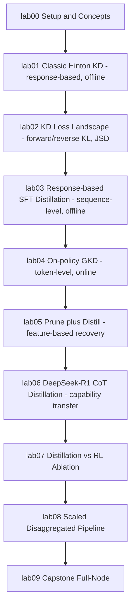

# Lab 00 - Setup & the Taxonomy of Distillation

**Goal:** confirm your environment works end-to-end (transformers + vLLM +
DeepSpeed on GPU), and build a mental map of the distillation techniques
you'll implement in labs 01-09.

**Hardware:** 1 GPU, a couple of minutes.

## What is "distillation"?

In both classical ML and LLMs, **knowledge distillation (KD)** means
training a smaller/cheaper **student** model to reproduce the behavior of a
larger/more-capable **teacher** model, so you end up with something that is
faster and cheaper to run while retaining as much of the teacher's
capability as possible. The term comes from Hinton, Vinyals, and Dean's 2015
paper *"Distilling the Knowledge in a Neural Network"* (lab01 implements
their method exactly).

The rest of this curriculum is organized around a few independent axes you
can mix and match:

### 1. What signal is transferred

| Type | What's matched | Example lab |
|---|---|---|
| **Response-based** | Final output only - soft labels (class probabilities) or generated text | lab01, lab03 |
| **Feature-based** | Intermediate representations - hidden states, attention maps | lab05 (residual-stream similarity for pruning) |
| **Relation-based** | Relationships *between* samples/layers (e.g. similarity matrices), not raw activations | mentioned, not a dedicated lab here |

### 2. Where the training signal comes from

| Type | Description | Example lab |
|---|---|---|
| **Offline distillation** | Teacher is frozen and only used to generate data / soft labels ahead of time; student trains on a fixed dataset | lab01, lab03 |
| **Online distillation** | Teacher and student interact during training - e.g. the student generates rollouts and the teacher scores/corrects them live | lab04 (GKD), lab08 |

### 3. What the student imitates the output *distribution* vs. *samples*

| Type | Description | Example lab |
|---|---|---|
| **Word/token-level KD** | Minimize a divergence (KL, JSD, ...) between the full teacher and student probability distributions at every position | lab02, lab04 |
| **Sequence-level KD** | Student is trained (via plain cross-entropy / SFT) on complete sequences *sampled* from the teacher, rather than matching its full distribution | lab03, lab06 |

### 4. Compression-oriented distillation

Distillation is also used as the *recovery* step after compressing a model
structurally (pruning layers/width, quantization): shrink the architecture
first, then fine-tune the smaller network against the original as a
teacher to recover quality. This is how NVIDIA's Minitron and ShortGPT-style
approaches build small models cheaply from big ones. See lab05.

### 5. Distilling capabilities, not just compressing size

Modern "distillation" often isn't about compression at all - it's about
transferring a *specific capability* (e.g. multi-step reasoning) from an
expensive frontier model into a cheap one that wouldn't have learned that
capability on its own. DeepSeek-R1's distilled model family is the
canonical recent example, and labs 06-07 reproduce that recipe (including
the paper's own finding that this beats training the small model with RL
directly).

## Roadmap



## Run it

```bash
pip install -e ../../.     # one-time, installs the `common` package (from repo root: pip install -e .)
python 00_verify_setup.py
```

This will:
1. Print your GPU inventory and confirm bf16/CUDA/NCCL work.
2. Load a tiny instruction model (`Qwen/Qwen2.5-0.5B-Instruct`) with
   `transformers` and generate a response.
3. Load the *same* model with `vLLM` and generate a response, confirming
   both stacks work (labs 03/04/06/07/08/09 use vLLM for fast batched
   teacher generation).
4. Import `deepspeed` and (optionally) `flash_attn` and print their
   versions.

If everything prints `OK`, you're ready for lab01.
