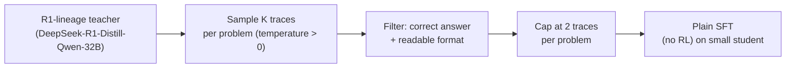

# Lab 06 - Reasoning / Chain-of-Thought Distillation: a DeepSeek-R1 Case Study

**Goal:** reproduce, at small scale, exactly the recipe DeepSeek-R1's
paper used to transfer multi-step reasoning ability into small dense
models - rejection-sampling generation, correctness+readability filtering,
and plain SFT (no RL) on the result.

**Hardware:** 2-4 GPUs (the teacher is a 32B model), ~75 minutes.

**Paper:** DeepSeek-AI. ["DeepSeek-R1: Incentivizing Reasoning Capability
in LLMs via Reinforcement Learning."](https://arxiv.org/abs/2501.12948)
2025, Section 2.4 ("Distillation: Empower Small Models with Reasoning
Capability").

## What DeepSeek-R1's paper actually did

It's easy to conflate "DeepSeek-R1" with "the RL algorithm (GRPO)", but the
paper's own small distilled models (`DeepSeek-R1-Distill-Qwen-1.5B/7B/...`,
`DeepSeek-R1-Distill-Llama-8B/70B`) were **not** trained with RL at all:

> "We directly fine-tuned open-source models such as Qwen ... and Llama
> ... using the 800k samples curated with DeepSeek-R1 ... We did not apply
> an RL stage for these distilled models."

The 800k-sample dataset itself was built by (a) sampling many candidate
reasoning traces per problem from the strong reasoning-tuned teacher, (b)
keeping only the ones with a **correct final answer** (rule-based check for
math/code) and **readable** formatting (dropping traces with mixed
languages, excessive length, or degenerate repetition), then (c) plain
supervised fine-tuning the small model on what's left. This lab reproduces
exactly that pipeline, at GSM8K scale instead of the full 800k-sample,
multi-domain scale.



## What you'll do

1. **`generate_traces.py`** - rejection-sampling generation: draw `K=4`
   samples per GSM8K training problem (temperature 0.8) from
   `DeepSeek-R1-Distill-Qwen-32B` (chosen because it's already an
   open-weight member of the R1 lineage, so trace style/quality matches the
   paper rather than a generic instruct model).
2. **`filter_traces.py`** - keep only traces whose final answer is
   numerically correct (`common.eval_harness.gsm8k_correct`) and that pass
   a readability filter (word-count bounds, non-ASCII ratio as a crude
   mixed-language proxy, a repetition check for degenerate loops), capped
   at 2 kept traces per problem so easy problems don't dominate.
3. **`train_student_cot_sft.py`** - plain SFT (`trl.SFTTrainer`, ordinary
   next-token cross-entropy, **no RL**) of `Qwen2.5-1.5B` on the filtered
   traces.
4. **`evaluate_gsm8k.py`** - GSM8K pass@1 on held-out test problems,
   baseline (non-distilled) vs. CoT-distilled student, plus a
   "rejection-sampling coverage" plot showing why drawing multiple samples
   per problem (rather than just one) matters.

```bash
python generate_traces.py
python filter_traces.py
python train_student_cot_sft.py
python evaluate_gsm8k.py
```

## What to look for

- `results/filter_summary.json`: typically only a fraction of raw samples
  are both correct and readable - this is the "rejection" in rejection
  sampling doing real work, discarding wrong or garbled attempts.
- `results/rejection_sampling_coverage.png`: shows the fraction of training
  problems that end up with **at least one** usable trace as a function of
  `K`. With `K=1` (no rejection sampling, just take whatever the teacher
  says first) you lose every problem the teacher gets wrong on that single
  attempt; each additional sample recovers some of those problems, since
  even a 32B reasoning model doesn't get every attempt right on hard
  problems, but usually gets at least one of several attempts right. This
  is the concrete, measurable reason the paper samples multiple times per
  problem rather than once.
- `results/gsm8k_before_after.png`: `Qwen2.5-1.5B`'s baseline GSM8K pass@1
  (a small base model with no instruction tuning, so this is often quite
  low) vs. after CoT-SFT - expect a substantial jump, since the student is
  now imitating full worked solutions rather than trying to solve problems
  cold.
- Read a few outputs from `results/cot_student` directly - notice how the
  student picks up the *style* of long-form step-by-step reasoning (and,
  depending on the teacher, possibly `<think>...</think>`-style formatting)
  even on problems structurally different from anything it trained on.

## Next

Lab07 asks the question DeepSeek-R1's own paper asks in its Table 6: is
this SFT-distillation recipe actually *better* than just running RL
directly on the small model? We reproduce that ablation at this same
small scale.
