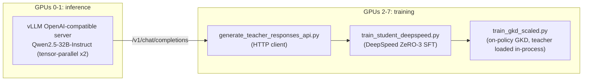

# Lab 08 - Scaled, Disaggregated Teacher/Student Pipeline

**Goal:** learn the production pattern for distilling from a genuinely
large teacher: serve the teacher as a standalone, throughput-optimized
inference endpoint on dedicated GPUs, and run student training completely
independently (different process, different GPUs, different framework)
against it.

**Hardware:** 6-8 GPUs (2 for the teacher server + the rest for student
training), ~60-90 minutes.

## Why disaggregate at all?

Labs 01-07 all load the teacher and student **in the same Python process**
on the same GPU(s). That's simple and fine up to a point, but it couples
two things that don't need to be coupled:

- **Teacher inference** wants an inference-optimized serving stack
  (continuous batching, prefix/KV caching, tensor parallelism for latency)
  running continuously and independently of whatever training code is
  iterating on the student.
- **Student training** wants a training-optimized stack (gradient
  checkpointing, ZeRO sharding, mixed precision, a completely different
  memory profile) that can be restarted, debugged, or scaled without
  touching the teacher at all.

Separating them means: the teacher server can serve *many* different
training jobs concurrently, training can be restarted without re-loading
a 32B/70B model, and each side can use however many GPUs makes sense for
its own workload rather than sharing one process's GPU allocation.

## The pipeline



1. **`serve_teacher_vllm.sh`** - launches `Qwen2.5-32B-Instruct` as a
   standalone, OpenAI-API-compatible vLLM server, tensor-parallel across 2
   GPUs. Leave this running in its own terminal for the rest of the lab.
2. **`generate_teacher_responses_api.py`** - the disaggregation payoff:
   generates the SFT training data by making plain HTTP requests (via
   `requests`, no extra client library needed) to the running server,
   exactly like a production training job would, decoupled from whatever
   GPUs/process actually runs the teacher.
3. **`train_student_deepspeed.py`** - SFT a larger student
   (`Qwen2.5-3B`) on that data using DeepSpeed **ZeRO-3** (shards
   optimizer state, gradients, and parameters across GPUs) on the GPUs
   *not* running the teacher server:
   ```bash
   deepspeed --num_gpus=6 --include localhost:2,3,4,5,6,7 train_student_deepspeed.py
   ```
4. **`train_gkd_scaled.py`** - re-runs lab04's on-policy GKD recipe at this
   larger teacher/student scale. **Caveat:** TRL's `GKDTrainer` needs the
   teacher's weights in the same process (it calls the teacher directly
   every training step to score the student's on-policy rollouts), so this
   step loads the 32B teacher in-process with `device_map="auto"` rather
   than querying the HTTP server - true disaggregation of an on-policy
   loop is possible but requires a custom loop that scores the student's
   exact sampled tokens via a teacher-side logprobs endpoint, which is
   meaningfully more complex/fragile than the sequence-level HTTP calls in
   step 2. That's flagged here as a stretch project, not implemented.
5. **`evaluate_scaled.py`** - compares baseline vs. scaled-SFT vs.
   scaled-GKD students, again judged via the running server's HTTP API.

```bash
# terminal 1 (leave running):
bash serve_teacher_vllm.sh

# terminal 2:
python generate_teacher_responses_api.py
deepspeed --num_gpus=6 --include localhost:2,3,4,5,6,7 train_student_deepspeed.py
python train_gkd_scaled.py     # loads the 32B teacher in-process - stop serve_teacher_vllm.sh first if GPU memory is tight
python evaluate_scaled.py      # restart serve_teacher_vllm.sh first if you stopped it
```

## What to look for

- Watch `serve_teacher_vllm.sh`'s logs while `generate_teacher_responses_api.py`
  runs: you'll see the server continuously batching multiple concurrent
  requests (`concurrency: 16` in `config.yaml`) - this is the throughput
  benefit of a dedicated inference server over the naive "load the model,
  generate a batch, unload it" pattern used in earlier labs.
- `results/scaled_winrates.png`: both scaled students should beat the
  non-distilled baseline by a wide margin, similar in shape to lab03/04's
  results but now with a substantially stronger (32B) teacher and larger
  (3B) student.
- Compare `deepspeed --num_gpus=6 ...`'s memory usage (check `nvidia-smi`
  while it runs) against what a naive DDP run would use - ZeRO-3's
  parameter/gradient/optimizer sharding is what makes it practical to
  scale this pattern up to student models that wouldn't otherwise fit
  comfortably in data-parallel training.

## Next

Lab09 is the capstone: combine everything from labs 01-08 (SFT
distillation, on-policy GKD, a full eval suite, and this lab's
disaggregated infrastructure pattern) into one end-to-end pipeline using
most or all of the node.
