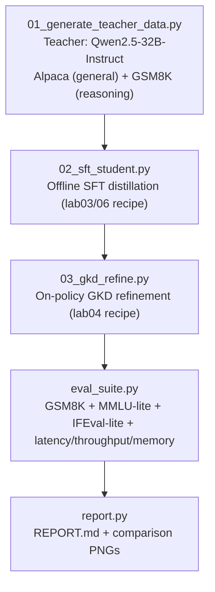

# Lab 09 - Capstone: Full 8-GPU Node Distillation Project

**Goal:** put everything from labs 00-08 together into one coherent
end-to-end pipeline - offline SFT distillation on a mixed
instruction+reasoning corpus, on-policy GKD refinement, and a full
multi-benchmark evaluation suite with a final generated report - at a
scale that uses most or all of the node.

**Hardware:** up to 8 GPUs, ~2-4 hours end-to-end.

## The pipeline



This combines: lab03's response-based SFT recipe, lab06's reasoning-CoT
data generation (rejection sampling is skipped here for time - a single
teacher sample per problem - see "Extensions" below to add it back), and
lab04's on-policy GKD refinement, evaluated with the same building blocks
(`common.eval_harness`) used throughout the curriculum, plus two new
benchmarks (MMLU-lite for general knowledge, IFEval-lite for instruction-following
precision) to round out the picture beyond math reasoning alone.

## Run it

```bash
python 01_generate_teacher_data.py   # ~3000 Alpaca instructions + ~1500 GSM8K problems from the teacher
python 02_sft_student.py             # offline SFT distillation
python 03_gkd_refine.py              # on-policy refinement (loads the 32B teacher in-process)
python eval_suite.py                 # full eval suite: teacher, baseline student, SFT student, final student
python report.py                     # writes results/REPORT.md + comparison PNGs
```

Default teacher/student: `Qwen2.5-32B-Instruct` -> `Qwen2.5-3B`. For the
stretch goal (a genuinely large teacher), pre-fetch a bigger model with
`python scripts/download_models.py --labs lab09 --stretch` and change
`teacher_model` in `config.yaml` to `Qwen/Qwen2.5-72B-Instruct` or
`meta-llama/Llama-3.1-70B-Instruct` (this needs most of the node's memory
just for the teacher, so budget accordingly and consider lab08's
disaggregated-serving pattern if you go this route).

## The eval suite

`eval_suite.py` runs, for the teacher, the non-distilled baseline student,
and the SFT/GKD-distilled students:

- **GSM8K pass@1** (`common.eval_harness.score_gsm8k`) - math reasoning,
  as in labs 06/07.
- **MMLU-lite** (`common.eval_harness.score_mmlu_lite`) - a small
  multi-subject slice of MMLU scored via loglikelihood (not generation),
  giving a quick general-knowledge signal beyond math.
- **IFEval-lite** (`_ifeval_lite.py`, local to this lab) - a handful of
  programmatically-verifiable instruction-following constraints (word
  limits, required/forbidden words, exact formatting) in the spirit of
  Google's IFEval benchmark - checks whether the student preserves
  *precise* instruction-following, not just "sounds like the teacher."
- **Latency / throughput / memory** - tokens/sec and peak GPU memory
  during generation, measured with a fresh vLLM engine per model so the
  numbers are directly comparable.

## What to look for

- `results/REPORT.md` and `results/report_accuracy.png`: the distilled
  student should sit clearly above the non-distilled baseline on all three
  accuracy metrics, and (depending on how much of the teacher's capability
  transfers at this size ratio) may close a substantial fraction of the
  teacher/baseline gap - the report prints this "gap closed" percentage
  explicitly.
- `results/report_throughput.png` and `results/report_memory.png`: this is
  the actual point of distillation as a *deployment* strategy, not just an
  academic exercise - the distilled student should be dramatically faster
  and lighter than the teacher. A `Qwen2.5-3B` student vs. a
  `Qwen2.5-32B-Instruct` teacher is roughly a 10x parameter reduction;
  expect throughput and memory improvements in a similar ballpark (exact
  numbers depend heavily on batch size, sequence length, and GPU).
- Compare `sft_student` (offline only) vs. `distilled_student` (offline +
  on-policy GKD refinement) in the report - this isolates how much the
  on-policy refinement step from lab04 adds on top of plain SFT, at this
  larger scale.

## Extensions (if you want to go further)

- Swap in a bigger teacher (see above) and/or bigger student
  (`Qwen2.5-7B`) and re-run - does the "gap closed" percentage change?
- Add lab06's rejection-sampling (K samples per GSM8K problem, filtered for
  correctness) into `01_generate_teacher_data.py`'s math-problem branch
  instead of the current single-sample generation, and see if it improves
  the final GSM8K pass@1.
- Wire up lab08's disaggregated vLLM-server pattern for step 1's data
  generation, so the teacher can be shared across multiple concurrent
  training experiments instead of loaded once per script run.
- Add a real IFEval or full MMLU evaluation (both are on the Hugging Face
  Hub) in place of the "-lite" versions used here, once you're comfortable
  with the plumbing.

## Curriculum complete

You've now implemented, from first principles, the full spectrum of
model/LLM distillation techniques: classic soft-label KD, forward/reverse
KL and Jensen-Shannon divergences, offline sequence-level distillation,
on-policy distribution-matching distillation, pruning + recovery,
DeepSeek-R1's reasoning-distillation recipe (and why it beats RL at small
scale), and the disaggregated infrastructure pattern used to run all of
this at production scale.
